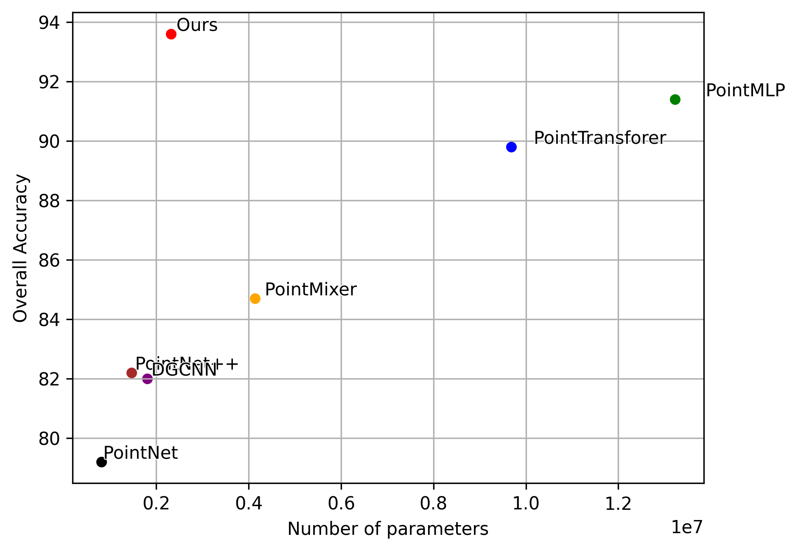
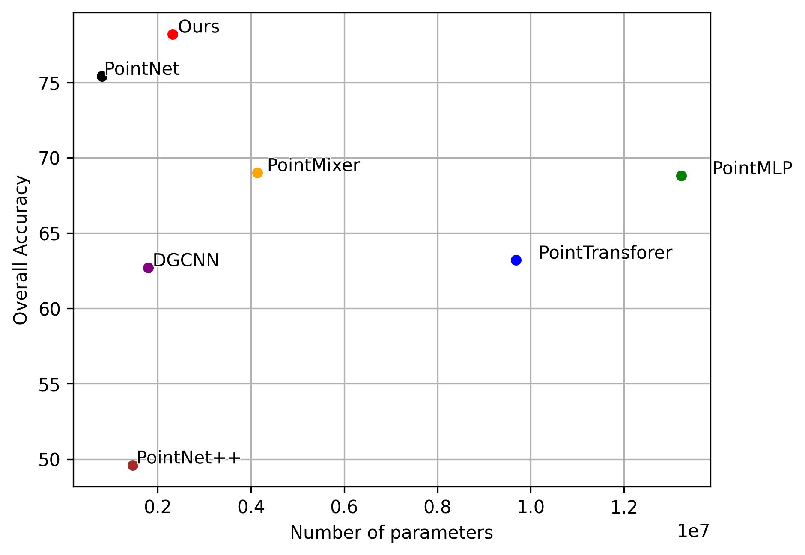

# PatchMixer: Rethinking network design to boost generalization for 3D point cloud understanding

## Shape classification

| Real RealSense &xrarr; Real Kinect | Real Kinect &xrarr; Real RealSense |
|:---:|:---:|
|  |  |

### Data

Create a softlink to the dataset folder:

```bash
ln -s /storage/TEV/dboscaini/PatchMixer_data data
```

Create folders for experiment logs:

```bash
mkdir data/exps/
mkdir data/exps/runs
mkdir data/exps/weights
```

Install PointTransformer dependencies:

```bash
pip install ninja
cd point-transformer/scene_seg/lib/pointops
python setup.py install
```
